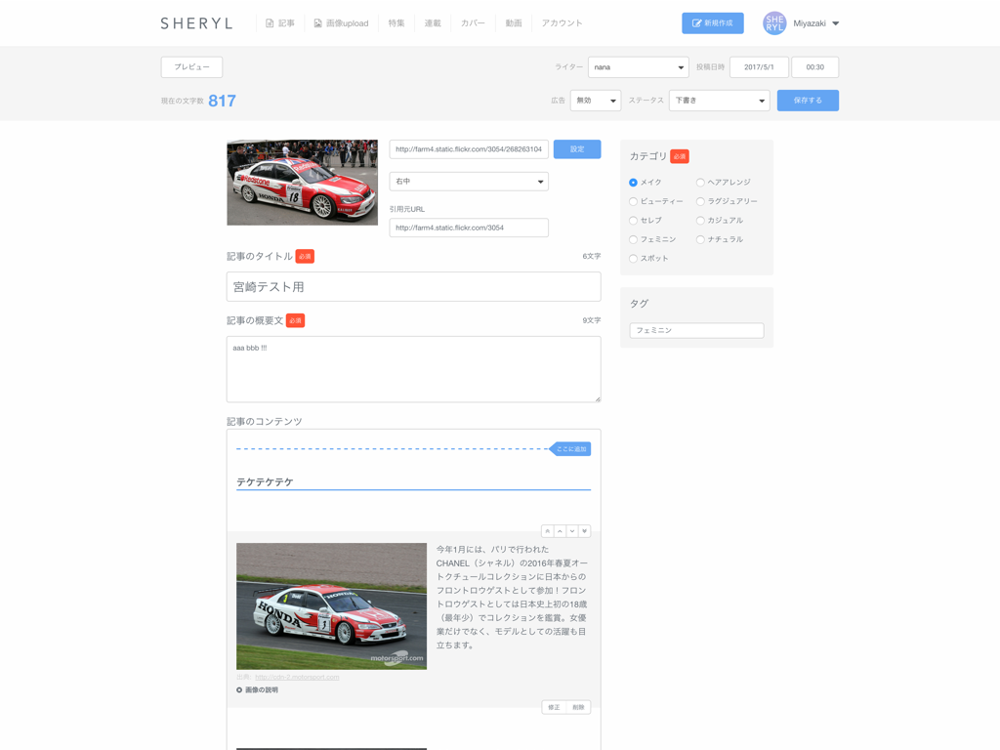

秋の JavaScript 祭 in mixi <!-- .element: class="slide-title slide-title--sub" -->
# React で CSS カプセル化の可能性を考える <!-- .element: class="slide-title" -->


## Yutaro Miyazaki (@vwxyutarooo)

- ニート
- フリーランス (Web 制作)
- 会社員 (フロントエンド)


###  <!-- .element: style="margin: 0; height: 600px;" -->
<!-- .element: style="margin: 0;" -->


###  <!-- .element: style="margin: 0;" -->
<!-- .element: style="margin: 0;" -->


###  <!-- .element: style="margin: 0;" -->
<!-- .element: style="margin: 0;" -->


###  <!-- .element: style="margin: 0; height: 600px;" -->
<!-- .element: style="margin: 0;" -->


- React
- Redux
- Riot
- Angular


---


### CSS カプセル化
- 全てがグローバルスコープ <!-- .element: class="fragment" data-fragment-index="0" -->
- 有効範囲を制限する <!-- .element: class="fragment" data-fragment-index="1" -->
- Scoped CSS <!-- .element: class="fragment" data-fragment-index="2" -->


- BEM・SMACSS・OOCSS
- ネームスペースで解決してきた


フロントエンド意外お断り


そんな CSS も Web Components ライクな  
JS フレームワークの台頭により変化の兆しが


##  <!-- .element: width="200" -->
- Shadow DOM (Shadow Boundary)

```html
<div>
  <style>
    .title { color: #444; }
  </style>

  <h3 class="title">Item name</h3>
</div>
```


##  <!-- .element: width="180" -->
- Scoped CSS

```html
<div>
  <style scoped>
    .title { color: #444; }
  </style>

  <h3 class="title">Item name</h3>
</div>
```


##  <!-- .element: width="164" -->
- encapsulation: ViewEncapsulation.Emulated <!-- .element: class="fragment" data-fragment-index="0" -->
- encapsulation: ViewEncapsulation.Native <!-- .element: class="fragment" data-fragment-index="0" -->


## Emulated
```js
@Component({
  selector: 'my-app',
  encapsulation: ViewEncapsulation.Emulated,
  styles: [`
    .test { padding: 10px; }
  `],
  template: `
    <div class="test">Test</div>
  `
})
```
<!-- .element: class="fragment" data-fragment-index="0" -->

```html
<body>
  <my-app _nghost-cmy-1="">
    <div _ngcontent-cmy-1="" class="test">Test</div>
  </my-app>
</body>
```
<!-- .element: class="fragment" data-fragment-index="2" -->

```css
.test[_ngcontent-cmy-1] {
  padding: 10px;
}
```
<!-- .element: class="fragment" data-fragment-index="3" -->


## Native
= Shadow DOM
```html
<body>
  <my-app>
    ▾ #shadow-root
      <style>
        .test { padding: 10px; }
      </style>
      <div class="test">
        <div>Test</div>
      </div>
  </my-app>
</body>
```


##  <!-- .element: width="180" -->

```html
<my-tag>
  <h3>{ opts.title }</h3>

  <style scoped>
    :scope { display: block; border: 2px }
    h3 { color: blue }
  </style>
</my-tag>
```
<!-- .element: class="fragment" data-fragment-index="1" -->

↓ <!-- .element: class="fragment" data-fragment-index="2" -->

```html
<style>
  my-tag { display: block; border: 2px }
  my-tag h3 { color: blue }
</style>
```
<!-- .element: class="fragment" data-fragment-index="2" -->


Custom Element 風に擬似カプセル化


##  <!-- .element: width="180" -->
vue-loader <!-- .element: class="fragment" data-fragment-index="0" -->


```html
<style scoped>
  .example {
    color: red;
  }
</style>

<template>
  <div class="example">hi</div>
</template>
```

↓

```html
<style>
  .example[_v-f3f3eg9] {
    color: red;
  }
</style>

<template>
  <div class="example" _v-f3f3eg9>hi</div>
</template>
```


---


##  <!-- .element: width="120" -->
React で CSS カプセル化の可能性 <!-- .element: class="fragment" data-fragment-index="0" -->


## 前提認識
ネイティブな Shadow DOM によるカプセル化は一旦忘れる


## 前提認識
全てのクラス・スタイルをカプセル化する必要はない


## 前提認識
- グローバルのままがいい <!-- .element: class="fragment" data-fragment-index="0" -->
  - Layout 要素 <!-- .element: class="fragment" data-fragment-index="1" -->
  - Utility <!-- .element: class="fragment" data-fragment-index="1" -->
- カプセル化したい <!-- .element: class="fragment" data-fragment-index="2" -->
  - Module 要素 <!-- .element: class="fragment" data-fragment-index="3" -->
  - コンポーネントで完結するもの <!-- .element: class="fragment" data-fragment-index="3" -->


---


## 可能性その1
CSS in JS


## CSS in JS
```js
const styles = {
  root: {
    color: color || avatar.color,
    backgroundColor: backgroundColor || avatar.backgroundColor,
    display: 'inline-flex',
    alignItems: 'center',
    justifyContent: 'center',
    fontSize: size / 2,
    borderRadius: '50%',
    height: size,
    width: size
  }
};

return(
  <div style={ styles.root }></div>
);
```


### 採用している React Component
- Material UI
- React Toolbox
- reactjs/react-modal


## ない


## ない


## ない


## ない


## ない


## ない


## ない


## ない


## ない


## ない


## キモい


## 嫌だ


## ない


## ごめん


## 言いすぎた


## CSS in JS の問題
- 擬似クラス (:hover, :before, :after)
- メディアクエリ
- CSS アニメーション
- シンタックス


### CSS in JS 系リポジトリ
- cssinjs/jss
- cssinjs/react-jss
- ***FormidableLabs/radium*** <!-- .element: style="color: #268bd2;" -->
- martinandert/react-inline
- smyte/jsxstyle


```js
var Radium = require('radium');
var React = require('react');
var color = require('color');

@Radium
class Button extends React.Component {
  render() {
    return (
      <button style={[ styles.base, styles[this.props.kind] ]}></button>
    );
  }
}

var styles = {
  base: {
    color: '#fff',
    ':hover': {
      background: color('#0074d9').lighten(0.2).hexString()
    }
  },
  ...
};
```


## アップサイド
- シンタックス意外の問題は解決された
- Style の 一部は Prop で渡せる
- 考える必要なし


## ダウンサイド
- CSS じゃない → 導入がハード
- ロックインし過ぎ
- カスケーディングしないだけ


### (因みに) こうなった

```css
@charset 'utf-8';
@import 'core/config';

.datepicker,
.timepicker {
  font-size: 12px !important;
  display: block !important;
  overflow: hidden;
  width: 100px !important;
  height: auto !important;
  border-width: 0 !important;
  > div {
    &:first-child {
      line-height: inherit !important;
      width: auto !important;
      height: auto !important;
    }
  }
  input {
    line-height: 2 !important;
    height: 36px !important;
    padding: 0 10px !important;
    text-align: center;
    color: $colorFont !important;
    border: 1px solid #ccc !important;
    background-color: #fff !important;
  }
  hr {
    display: none !important;
  }
}
```


---


## 可能性その2
CSS Module


### 特徴
- CSS を CSS として書ける
- ファイル単位でクラスに一意のハッシュを付与


```css
/* volume-slide.scss */
.slider {
  position: relative;
  height: 100%;
  &__track {
    position: absolute;
    top: 0;
    right: 0;
    bottom: 0;
    left: 0;
    width: 100%;
    margin: auto 0;
    background-color: rgba(255,255,255, .2);
  }
  &__handle {
    position: absolute;
    top: 0;
    bottom: 0;
    left: 0;
    margin: auto;
    cursor: pointer;
    border-radius: 50px;
    background-color: #fff;
    &:before {
      position: absolute;
      top: 0;
      bottom: 0;
      left: -475px;
      display: block;
      width: 500px;
      height: 10px;
      margin: auto 0;
      background-color: #fff;
    }
    &:after {
      position: absolute;
      top: 0;
      bottom: 0;
      left: 25px;
      display: block;
      display: block;
      width: 500px;
      height: 10px;
      margin: auto 0;
      background-color: rgba(255,255,255, .2);
    }
  }
}
```


```js
// volume-slider.react.js
import styles from './volume-slider.scss';
```

render: <!-- .element: class="fragment" data-fragment-index="0" -->

```html
<slider className={ styles.slider }>
  <div className={ styles.slider__track + ' ' + styles.black }></div>
  <div className={ classnames(styles.slider__handle, styles.black) }></div>
</slider>
```
<!-- .element: class="fragment" data-fragment-index="0" -->

出力: <!-- .element: class="fragment" data-fragment-index="1" -->

```html
<slider class="volume-slider__slider___2qmBE">
  <div class="volume-slider__slider__track___1Okwk volume-slider__black___3-0A8"></div>
  <div class="volume-slider__slider__handle___X_x8Q volume-slider__black___3-0A8"></div>
</slider>
```
<!-- .element: class="fragment" data-fragment-index="1" -->

`ファイル名__クラス名__5桁のハッシュ` <!-- .element: class="fragment" data-fragment-index="1" -->  


## アップサイド
- ファイル分割さえしていれば移行はスムーズ
- SMACSS の Module だけを置き換え
- css-module やめるときも特に何もしなくていい


## ダウンサイド
- Webpack とか Browserify の設定が必要
- 配布側では使えない


### Webpack
```js
{
  test: /\.css$/,
  loaders: [
    'style',
    'css?modules&importLoaders=1&localIdentName=[name]__[local]___[hash:base64:5]',
    'postcss-loader',
    'sass'
  ] 
}
```

### Browserify
- modularify
- postcss-modules


---


## 可能性その2.5
React CSS Module


## React CSS Modules
> CSS Modules だと not enough


## CSS Modules は
- キャメルケースのクラス名に制限 <!-- .element: class="fragment" data-fragment-index="0" -->
- style オブジェクトの利用 <!-- .element: class="fragment" data-fragment-index="1" -->
- グローバル, ローカルスコープのクラスの分別 <!-- .element: class="fragment" data-fragment-index="2" -->
- 未定義の CSS クラス参照時 (エラー出ない) <!-- .element: class="fragment" data-fragment-index="3" -->


## React CSS Modules は
- クラス名はスネークケースもいけるよ <!-- .element: class="fragment" data-fragment-index="0" -->
- className に style オブジェクト付けなくていいよ <!-- .element: class="fragment" data-fragment-index="1" -->
- グローバル, ローカルスコープのクラスが一目瞭然だよ <!-- .element: class="fragment" data-fragment-index="2" -->
- 定義してないクラスにエラー吐くよ <!-- .element: class="fragment" data-fragment-index="3" -->


```js
// volume-slider.react.js
import CSSModules from 'react-css-modules';

import styles from  './volume-slider.scss';
```

render: <!-- .element: class="fragment" data-fragment-index="0" -->
```html
<div styleName="slider">
  <div styleName="slider__track"></div>
  <div styleName="slider__handle">
  </div>
</div>
```
<!-- .element: class="fragment" data-fragment-index="0" -->

```js
export default CSSModules(VolumeSlider, styles);
```
<!-- .element: class="fragment" data-fragment-index="1" -->

出力: <!-- .element: class="fragment" data-fragment-index="2" -->
```html
<div class="volume-slider__slider___2qmBE">
  <div class="volume-slider__slider__track___1Okwk volume-slider__black___3-0A8"></div>
  <div class="volume-slider__slider__handle___X_x8Q"></div>
</div>
```
<!-- .element: class="fragment" data-fragment-index="2" -->


グローバルなクラス = `className`

render:
```html
<div className="global-css-class" styleName="slider">
  <div styleName="slider__track"></div>
  <div styleName="slider__handle">
  </div>
</div>
```


ES7 Decorator がおすすめ
```js
@CSSModules(styles, { allowMultiple: true })
export default class VolumeSlider extends React.Component {}
```


## アップサイド
- いいかも
- ES7 の Decorator 使えば綺麗


## ダウンサイド
- 依存関係が1個増える


---


## 可能性その3
Custom Element 風


##  <!-- .element: width="180" -->


## 結論
- React には無い <!-- .element: class="fragment" data-fragment-index="0" -->


## ただし


### コンポーネントを配布する側では使いたい


```js
import Select from 'react-select';

// Be sure to include styles at some point, probably during your bootstrapping
import 'react-select/dist/react-select.css';
```

react-select・react-spinner・react-slider


React でやろうとする場合、loader から  
= 現状だと scss 側で対応


## ダウンサイド
- 外部からの影響は受ける
  - グローバルがクリーンである必要
  - 多少ユニークなクラス名が必要
- HTMLUnknownElement...?


---


## まとめ: React で CSS カプセル化は...
- 実用レベルであり
- 配布する時は Custom Element 風
- 末端での利用ならば `react-css-module`
